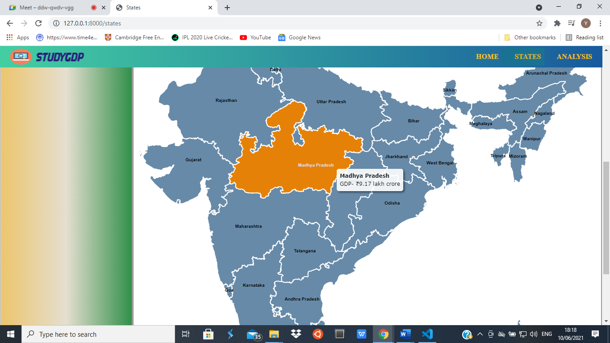
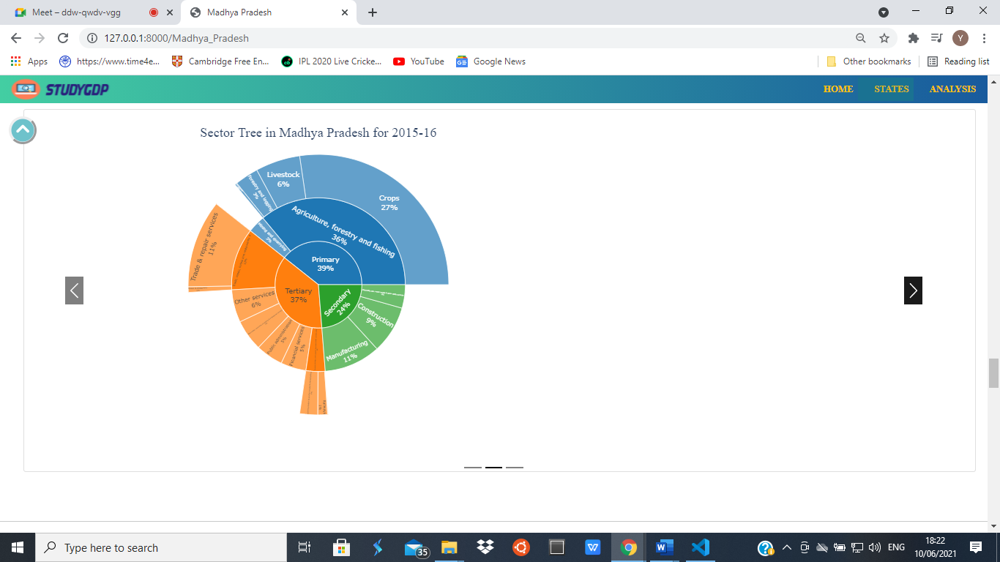
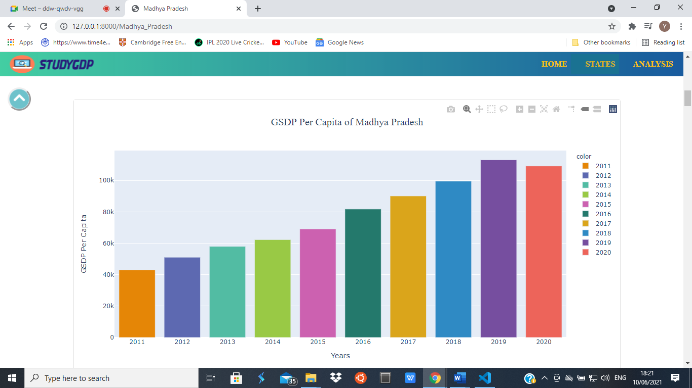
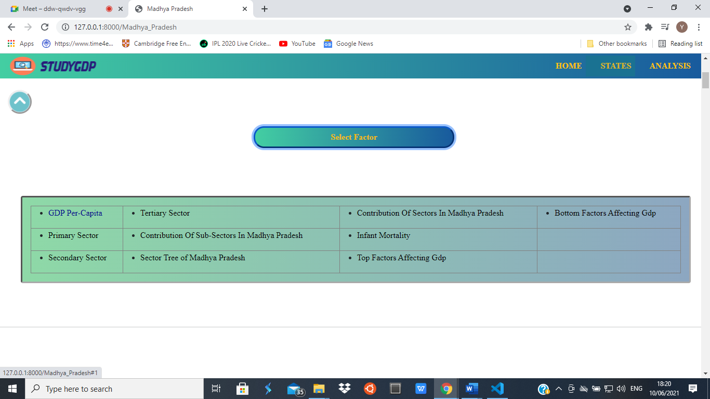
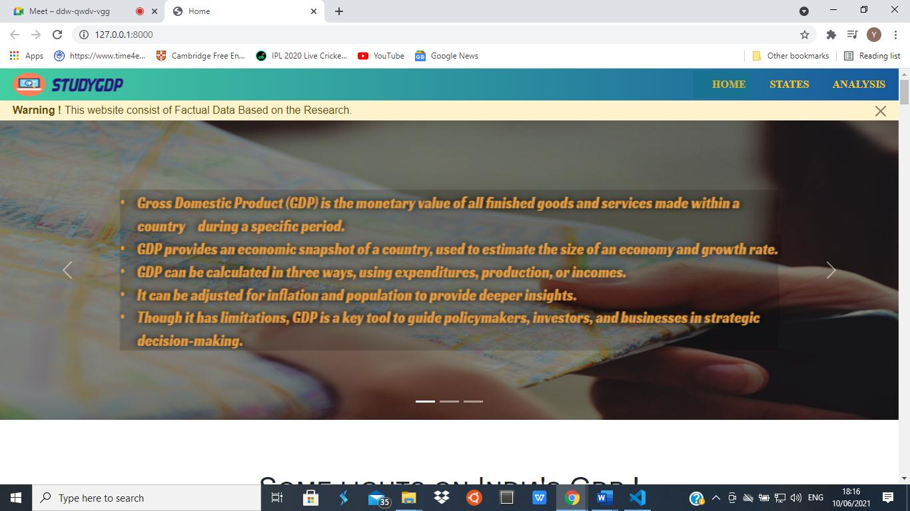
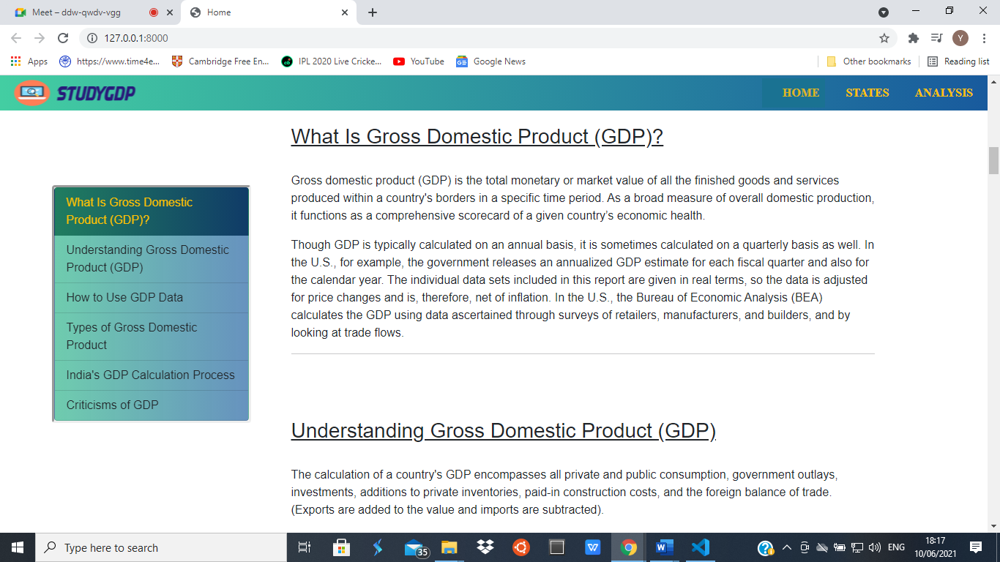
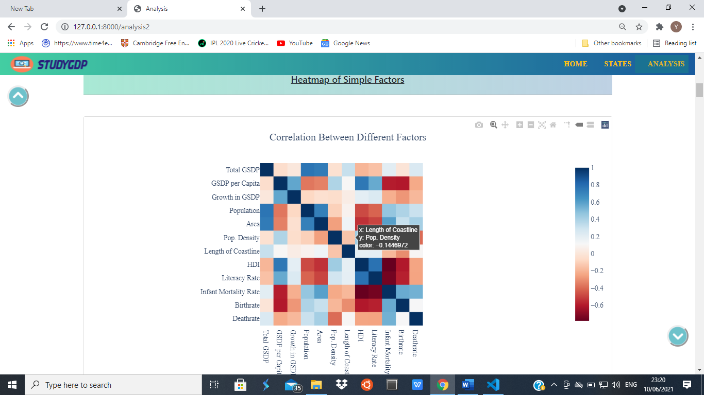
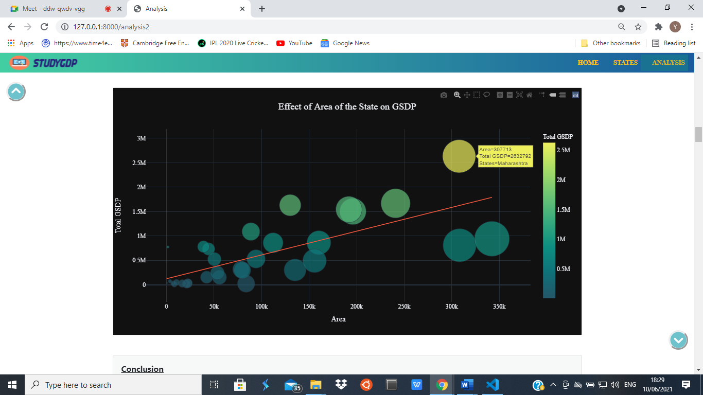
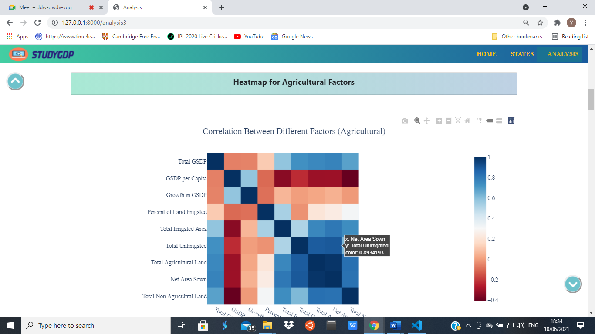

# data_visualization_project
it is a project of data visualization based on INDIA's GDP according to sectors. contains visualization and automation skills.
for all the states
- data analysis
- visualization
- automation
- graphs were created for a data analysis project with explaination
- reactive graphs with plotly

